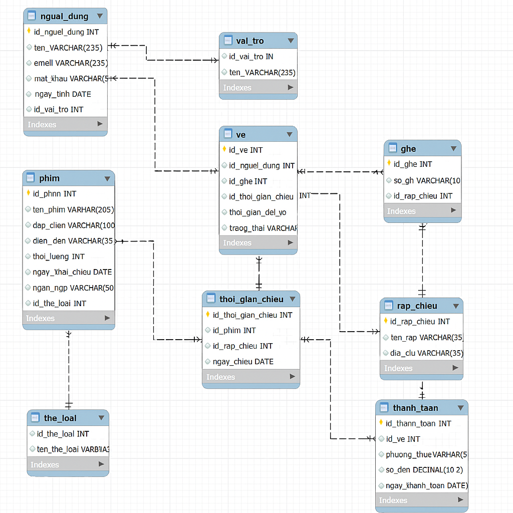

# 🎬 Booking System – Đặt Vé Xem Phim

## 📑 Mục lục
- [Giới thiệu](#-giới-thiệu)
- [Tính năng chính](#-tính-năng-chính)
- [Database Design](#-database-design)
- [Công nghệ sử dụng](#-công-nghệ-sử-dụng)
- [Cài đặt & chạy dự án](#-cài-đặt--chạy-dự-án)
- [API Endpoints](#-api-endpoints)
- [Kế hoạch phát triển](#-kế-hoạch-phát-triển)
- [Tác giả](#-tác-giả)

---

## 📌 Giới thiệu
**Booking System** là một ứng dụng **đặt vé xem phim trực tuyến** được xây dựng bằng **Java Spring Boot, MySQL, Thymeleaf **.

- Người dùng: đăng ký, đăng nhập, tìm kiếm phim, đặt vé, quản lý vé.
- Quản trị viên: quản lý phim, rạp chiếu, suất chiếu, người dùng và doanh thu.

---

## 🚀 Tính năng chính

### 👤 Người dùng
- Đăng ký tài khoản & đăng nhập (BCrypt + JWT).
- Tìm kiếm phim, xem lịch chiếu theo ngày.
- Đặt vé (chọn suất chiếu, chọn ghế).
- Xem lịch sử vé đã đặt, hủy vé.
- Nhận email xác nhận khi đặt vé (tùy chọn).

### 🔧 Quản trị viên
- Quản lý phim, rạp chiếu, suất chiếu.
- Quản lý người dùng & phân quyền (USER / ADMIN).
- Xem thống kê vé và doanh thu.
- Chặn xóa suất chiếu đã có vé.

---

## 🗄️ Database Design

### Các bảng chính
- **Movie** – Phim
- **Cinema** – Rạp chiếu
- **Showtime** – Suất chiếu
- **Seat** – Ghế
- **Ticket** – Vé
- **User** – Người dùng
- **Role** – Vai trò
- **Pay** - Thanh Toán

### ERD Minh Họa


### 🛠️Công nghệ sử dụng
- **Backend**: Java Spring Boot, Spring Security, Spring Data JPA
- **Frontend**: Thymeleaf 
- **Database**: MySQL
- **Authentication**: JWT + BCrypt
- **API Docs**: Postman

### 📦 Cài đặt & chạy dự án
1. Clone dự án
```mermaid
   git clone https://github.com/your-username/booking-system.git
   cd booking-system
```
2. Cấu hình Database
- Trong src/main/resources/application.properties:
```mermaid
spring.datasource.url=jdbc:mysql://localhost:3306/booking_system
spring.datasource.username=root
spring.datasource.password=yourpassword
spring.jpa.hibernate.ddl-auto=update
spring.jpa.show-sql=true
```
3. Chạy ứng dụng
```mermaid
./mvnw spring-boot:run
```
### 📖 API Endpoints (ví dụ)
**Auth**
- POST /api/auth/register – Đăng ký
- POST /api/auth/login – Đăng nhập
**Movie**
- GET /api/movies – Danh sách phim
- POST /api/movies – Thêm phim (ADMIN)
### 👨‍💻Tác giả

Nguyễn Thế Mạnh – Backend Developer

Liên hệ: manhnt7799@gmail.com
